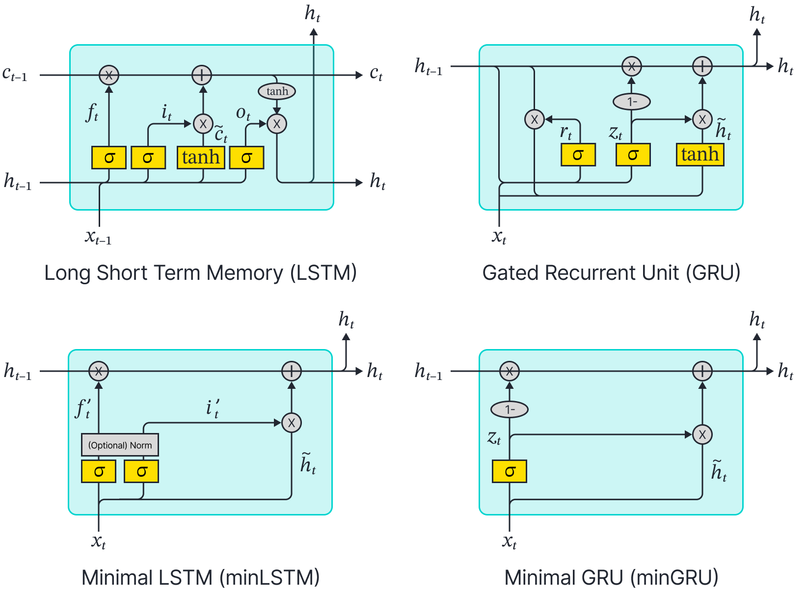

# Were RNNs All We Needed?

This is the official repository for the paper [Were RNNs All We Needed?](https://arxiv.org/abs/2410.01201) ([research blog post on the paper](https://rbcborealis.com/research-blogs/minimal-lstms-and-grus-simple-efficient-and-fully-parallelizable/)). This repository contains the code for the parallelized minRNNs (minLSTM and minGRU) implementations. 

|  | 
|:--:| 
| *Simplification of Traditional RNNs to Minimal RNNs (minRNNs):* The top row illustrates popular decades-old RNN models that were strictly sequential during training. This reliance made them less efficient and contributed to their eventual deprecation in favor of more advanced parallelizable architectures such as Transformers. The bottom row introduces the proposed minimal versions of these RNNs—minRNNs—which require fewer parameters and can be trained in parallel using a parallel scan algorithm. Despite their simplicity, minRNNs achieve strong performance comparable to that of modern models. |

## Install

Create and activate a conda environment. Install the dependencies as listed in `requirements.txt`:

```
conda create --name minRNNs python=3.9
conda activate minRNNs
pip install -r requirements.txt
```

## Usage

The default hyperparameters are saved in `configs/`. Model weights and logs are saved in `results/{task}/{expid}`. Note that when running experiments, the `{expid}` must match between training and evaluation since the model will load weights from `results/{task}/{expid}` when evaluating. If training for the first time, evaluation data will be generated and saved in `eval_datasets/{task}`.

**Training:**

```
python main.py --mode train --model minGRU --expid mingru --task selective_copy
python main.py --mode train --model minLSTM --expid minlstm --task selective_copy
```

**Evaluation:**

```
python main.py --mode test --model minGRU --expid mingru --task selective_copy
python main.py --mode test --model minLSTM --expid minlstm --task selective_copy
```

## Reference

For technical details, please check the arXiv version of our paper.
```
@article{feng2024minRNNs,
  title={Were RNNs All We Needed?},
  author={Feng, Leo and Tung, Frederick and Ahmed, Mohamed Osama and Bengio, Yoshua and Hajimirsadeghi, Hossein},
  journal={arXiv preprint arXiv:2410.01201},
  year={2024},
  url={https://arxiv.org/abs/2410.01201},
}
```

## Acknowledgement

We would like to thank Phil Wang (lucidrains) for their [implementation of minGRU](https://github.com/lucidrains/minGRU-pytorch), released shortly after the paper's upload to arXiv. This public codebase (minRNNs) is a cleaned and simplified version of our original implementation, leveraging useful modules from lucidrains' repository.
